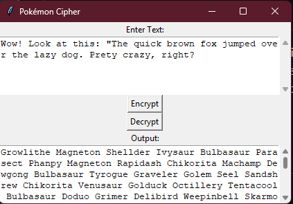

# Pokémon Cipher

A creative encryption tool that converts text messages into sequences of Pokémon names using regional Pokédex entries.

## Overview

Pokémon Cipher is a polyalphabetic substitution cipher that maps ASCII characters to Pokémon names from different regional Pokédexes. When a character repeats in a message, the cipher cycles to the next region's Pokémon, making the encryption more complex and interesting.



## How It Works

### Encoding Process

1. Each printable ASCII character (32-126) maps to a Pokémon at the corresponding position in a regional Pokédex
2. The first occurrence of a character uses the Kanto Pokédex
3. When a character repeats, the cipher cycles to the next region (Johto)
4. When all available regions are used, it cycles back to the first region

### Decoding Process

The decoder identifies which Pokémon name corresponds to which character and reconstructs the original message.

### Example

The message "hello" would be encoded as:
- 'h' → Kadabra (Kanto)
- 'e' → Paras (Kanto)
- 'l' → Diglett (Kanto)
- 'l' → Ledyba (Johto) - notice the region change for the repeated 'l'
- 'o' → Shellder (Kanto)

## Features

- Encrypt any text to Pokémon names
- Decrypt Pokémon names back to original text
- Simple GUI interface
- Preserves case, punctuation, and special characters
- Region cycling for repeated characters

## Requirements

- Python 3.x
- tkinter (usually included with Python)

## Usage

1. Run the script:
```
python pokemon_cipher.py
```

2. Enter text in the top text box
3. Click "Encrypt" to convert to Pokémon names
4. Click "Decrypt" to convert Pokémon names back to text

## Technical Details

### ASCII Mapping

The cipher maps printable ASCII characters (32-126) to Pokémon:
- ASCII 32 (space) → First Pokémon in each region (Bulbasaur/Chikorita)
- ASCII 33 (!) → Second Pokémon in each region (Ivysaur/Bayleef)
- And so on...

### Optimization

The repository contains two versions:
- `pokemon_cipher.py` - Original implementation
- `pokemon_cipher_optimized.py` - Optimized version with lookup tables

The optimized version improves decoding performance from O(n × r × p) to O(n) by using precomputed lookup tables.

## Extending the Cipher

You can add more regions (Hoenn, Sinnoh, etc.) by updating the `regions` dictionary with additional Pokémon lists. Each region must have at least 95 Pokémon to cover all printable ASCII characters.

## Use Cases

- Educational tool for teaching cryptography concepts
- Fun puzzles for Pokémon enthusiasts
- Secret messages for fan communities
- Themed challenges for escape rooms or scavenger hunts

## License

[MIT License](LICENSE)

## Acknowledgments

- Pokémon names and characters are property of Nintendo/Game Freak
- This project was created for educational and entertainment purposes only
