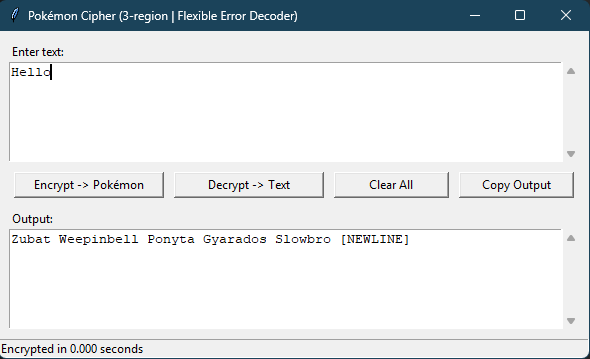

# PokéCipher

A retro, Pokédex-themed web app that encrypts text into sequences of Pokémon
names and decrypts them back again. Built with Next.js and Python, deployed on
Vercel.



## What the cipher does

PokéCipher is a **stateful polyalphabetic substitution cipher**. It maps
printable ASCII characters (codes 32–126) onto regional Pokédex entries:

1. Normalise a character to an index: `index = ord(char) - 32`.
2. Look up how many times that character has already appeared.
3. Pick the region by cycling: the Nth occurrence uses region `N % 3`
   (Kanto → Johto → Hoenn → Kanto …).
4. Emit the Pokémon at `index` in that region's list; increment the count.

Because the same character rarely maps to the same Pokémon twice, and because
Pokémon names legitimately repeat across regional dexes, decoding is genuinely
ambiguous. That is the interesting part of the cipher, not a bug.

### Example

`Hello` encodes to:

```
Zubat Weepinbell Ponyta Gyarados Slowbro
```

Note the two `l`s become `Ponyta` then `Gyarados`: the second `l` has cycled to
the Johto list.

### Decoder output

| Notation | Meaning |
|---|---|
| `x` | Decoded unambiguously. |
| `[x,y]` | **Ambiguity** — the cipher is lossy here and several characters remain valid. |
| `{x,y}` | **State mismatch** — no valid interpretation; the ciphertext is likely corrupted. |
| `<?unknown: X>` | `X` is not a known Pokémon name. |

`Hello World!` round-trips to `Hello W[n,o]rld!`: `Slowpoke` maps to both `n`
(Kanto) and `o` (Johto), and nothing later in the message disambiguates it.

Decoding forks one hypothesis per candidate character and merges hypotheses that
reconverge, so a later Pokémon often resolves an earlier ambiguity after the
fact — `Nidoking Geodude Shroomish Nidoking` decodes cleanly to `AAAA`, even
though `Geodude` on its own is ambiguous.

## Architecture

Full-stack, with Python as the single source of truth for the cipher:

```
pokecipher/   Cipher core, one concern per module.
api/          Vercel Python serverless functions: POST /api/encode, /api/decode.
next-app/     Next.js 16 + React 19 + Tailwind v4 + shadcn/ui frontend.
cipher.py     Backwards-compatible re-export shim.
```

The frontend never re-implements the cipher. It calls the Python functions, so
the algorithm and the Pokédex data exist in exactly one place.

Pokémon output toggles between sprites and names. Sprites are served from the
PokémonDB CDN keyed by name, falling back to the name when a slug is unknown.

## Running it locally

Python side, from the repository root:

```bash
python -m pip install -r requirements-dev.txt
python -m pytest          # run the test suite
python -m ruff check .    # lint
```

Frontend, from `next-app/`:

```bash
npm ci
npm run dev               # http://localhost:3000
```

## Deployment

Deployed on Vercel as **two projects from this repository**, because Vercel
cannot host a Next.js app and Python serverless functions in a single project:

| Project | Root directory | Serves |
|---|---|---|
| API | `.` (repository root) | `api/encode.py`, `api/decode.py` |
| Web | `next-app` | the Next.js frontend |

Both deploy on push to `main`; every pull request gets a preview URL. Copy
`next-app/.env.example` to `.env.local` and set `NEXT_PUBLIC_API_URL` to the API
project's URL (for example `https://pokecipher-api.vercel.app`). Left empty, the
frontend calls `/api/*` on its own origin.

## API

Both endpoints take `POST {"text": "..."}` and return `{"result": "..."}`.
Input is capped at 4,000 characters, because decode time grows quadratically
with message length.

```bash
curl -X POST https://<api>/api/encode -d '{"text":"Hello"}'
# {"result":"Zubat Weepinbell Ponyta Gyarados Slowbro"}
```

## Known limitations

- **Decode time depends on how much ambiguity survives.** The decoder emits each
  position as soon as it is final, so ordinary text stays close to linear —
  measured on CPython 3.13, ~1.2 s for 10,000 characters of prose. Text that
  sustains an unresolved ambiguity throughout cannot collapse and degrades to
  quadratic (~3.3 s at 4,100 characters). The API caps input at 4,000 characters
  so even that worst case fits inside the function timeout.
- **The cipher is not cryptographically secure.** It is a puzzle and a teaching
  tool for substitution ciphers and state tracking, not a way to protect data.
- Only the first 95 entries of each regional dex are used. Names containing
  spaces (Mr. Mime, Tapu Koko) cannot be added without changing the delimiter.

## Project conventions

See [AGENTS.md](AGENTS.md) for the architecture rules, testing expectations, and
deployment details that contributors and AI agents should follow.
