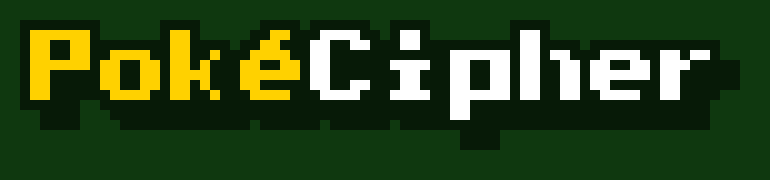
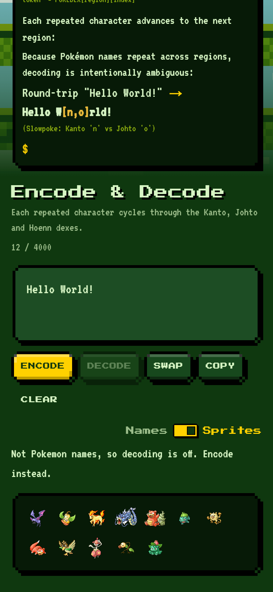

<p align="center">
  
</p>

<p align="center">
  <a href="https://github.com/pterw/PokeCipher/actions/workflows/ci.yml"></a>
  <a href="https://poke-cipher.vercel.app"></a>
  
  <a href="https://docs.astral.sh/ruff/"></a>
</p>

A retro, Pokédex-themed web app that encrypts text into sequences of Pokémon
names and decrypts them back again. Type a sentence and it comes back as a row of
Game Boy sprites; feed that row back in and you get the sentence — usually, but
not always, verbatim. That "not always" is the interesting part, and the rest of
this README explains why.

Built with Next.js and Python, deployed on Vercel.




## What the cipher does

PokéCipher is a **stateful polyalphabetic substitution cipher**. It maps
printable ASCII characters (codes 32–126) onto regional Pokédex entries:

1. Normalise a character to an index: `index = ord(char) - 32`.
2. Look up how many times that character has already appeared.
3. Pick the region by cycling: the Nth occurrence uses region `N % 3`
   (Kanto → Johto → Hoenn → Kanto …).
4. Emit the Pokémon at `index` in that region's list; increment the count.

Because the same character rarely maps to the same Pokémon twice, and because
Pokémon names legitimately repeat across regional dexes, decoding is genuinely
ambiguous. That is the interesting part of the cipher, not a bug.

### Example

`Hello` encodes to:

```
Zubat Weepinbell Ponyta Gyarados Slowbro
```

Note the two `l`s become `Ponyta` then `Gyarados`: the second `l` has cycled to
the Johto list.

### Decoder output

| Notation | Meaning |
|---|---|
| `x` | Decoded unambiguously. |
| `[x,y]` | **Ambiguity** — the cipher is lossy here and several characters remain valid. |
| `{x,y}` | **State mismatch** — no valid interpretation; the ciphertext is likely corrupted. |
| `<?unknown: X>` | `X` is not a known Pokémon name. |

`Hello World!` round-trips to `Hello W[n,o]rld!`: `Slowpoke` maps to both `n`
(Kanto) and `o` (Johto), and nothing later in the message disambiguates it.

Decoding forks one hypothesis per candidate character and merges hypotheses that
reconverge, so a later Pokémon often resolves an earlier ambiguity after the
fact — `Nidoking Geodude Shroomish Nidoking` decodes cleanly to `AAAA`, even
though `Geodude` on its own is ambiguous.

## Architecture

Full-stack, with Python as the single source of truth for the cipher:

```
pokecipher/   Cipher core, one concern per module.
app.py        FastAPI app: /api/encode, /api/decode, /api/names.
next-app/     Next.js 16 + React 19 + Tailwind v4 + shadcn/ui frontend.
cipher.py     Backwards-compatible re-export shim.
```

The frontend never re-implements the cipher. It calls the Python functions, so
the algorithm and the Pokédex data exist in exactly one place.

Pokémon output toggles between sprites and names. Sprites come from the
PokémonDB CDN, from the Generation 3 `ruby-sapphire` set — GBA-era pixel art,
matching both the palette and the Kanto/Johto/Hoenn roster. They are 64×64 and
drawn at 32px, an exact 2:1 downscale, so `image-rendering: pixelated` stays
faithful. A name whose slug the CDN does not know falls back to the name.

## Running it locally

Python side, from the repository root:

```bash
python -m pip install -e ".[dev]"
python -m pytest              # run the test suite
python -m ruff check .        # lint
uvicorn app:app --port 8000   # serve the API for the frontend
```

The frontend proxies `/api/*` to port 8000 in local development, so run that
alongside `npm run dev`. It is the same `app.py` that runs in production.

Frontend, from `next-app/`:

```bash
npm ci
npm run dev               # http://localhost:3000
```

## Deployment

Deployed on Vercel as **two projects from this repository**, because a single
project cannot host both a Next.js app and a Python backend:

| Project | Root directory | Framework | Serves |
|---|---|---|---|
| API | `.` (repository root) | `fastapi` | `app.py`, as one Function |
| Web | `next-app` | `nextjs` | the Next.js frontend |

Both projects need their own `vercel.json`: the repository-root file reaches the
web project too, so `next-app/vercel.json` must pin `nextjs` or the web build
inherits the API's `fastapi` preset and fails.

Both deploy on push to `main`; every pull request gets a preview URL. Copy
`next-app/.env.example` to `.env.local` and set `NEXT_PUBLIC_API_URL` to the API
project's URL — `https://poke-cipher-api.vercel.app`. Left empty, the frontend
calls `/api/*` on its own origin, which in local development the Next rewrite
proxies to `http://localhost:8000`.

## API

`POST /api/encode` and `POST /api/decode` both take `{"text": "..."}` and return
`{"result": "..."}`. Failures return `{"error": "..."}` with a 400 or 413. Input
is capped at 4,000 characters, because decode time grows quadratically with
message length.

```bash
curl -X POST https://poke-cipher-api.vercel.app/api/encode -d '{"text":"Hello"}'
# {"result":"Zubat Weepinbell Ponyta Gyarados Slowbro"}
```

Decoding ignores case, so ciphertext that has been through a URL or a chat client
still works:

```bash
curl -X POST https://poke-cipher-api.vercel.app/api/decode   -d '{"text":"zubat weepinbell ponyta gyarados slowbro"}'
# {"result":"Hello"}
```

`GET /api/names` returns the 210 names the decoder accepts, sorted, cached for an
hour. The frontend uses it to tell ciphertext from plaintext before offering to
decode.

## Known limitations

- **Decode time depends on how much ambiguity survives.** The decoder emits each
  position as soon as it is final, so ordinary text stays close to linear —
  measured on CPython 3.13, ~1.2 s for 10,000 characters of prose. Text that
  sustains an unresolved ambiguity throughout cannot collapse and degrades to
  quadratic (~3.3 s at 4,100 characters). The API caps input at 4,000 characters
  so even that worst case fits inside the function timeout.
- **The cipher is not cryptographically secure.** It is a puzzle and a teaching
  tool for substitution ciphers and state tracking, not a way to protect data.
- Only the first 95 entries of each regional dex are used. Names containing
  spaces (Mr. Mime, Tapu Koko) cannot be added without changing the delimiter,
  and changing the delimiter would invalidate every message ever encoded.

## Branding assets

The wordmark and the favicon are generated rather than hand-drawn, so they stay
in step with the palette instead of drifting from it:

```bash
python docs/make_wordmark.py                # writes docs/wordmark.svg
python docs/make_favicon.py <sprite.png>    # writes icon.svg and favicon.ico
```

Both outputs are committed, so neither GitHub nor the deployment ever needs to
run these scripts.

- **`docs/wordmark.svg`** draws every letter from explicit pixel rectangles.
  GitHub cannot load webfonts inside a README image, so text set with `<text>`
  would fall back to whatever the viewer happens to have installed and stop
  looking like the app.
- **`docs/make_favicon.py`** writes two files, because Next.js publishes every
  icon it finds in `app/` and browsers choose between them inconsistently.
  `icon.svg` is vector and follows `prefers-color-scheme`; `favicon.ico` is a
  raster and cannot, so it carries its own field instead — a dark disc that reads
  on a light toolbar, ringed in a light colour that reads on a dark one. Both are
  built from the same sprite and the same geometry, so they cannot drift apart.

In neither format does the app's own theme toggle recolour the tab icon: a
favicon is drawn in browser chrome, outside the document, so it cannot see the
toggle. The favicon's art is the Generation 1 Pikachu sprite from Pokémon Yellow,
the era the Game Boy palette comes from. Sprite art is the property of
Nintendo / Game Freak / Creatures Inc., and the source sprite is not committed.

## TODO

[ ] Organize root repo (folders, etc.) 
[ ] Rework mobile UI (tweaks or redesign) 
[ ] Adresss prior review feedback 
[x] Replace screenshot
[x] Include README.MD badges 
[ ] Include social badges on webapp 

More to come. 

## Project conventions

See [AGENTS.md](AGENTS.md) for the architecture rules, testing expectations, and
deployment details that contributors and AI agents should follow.
